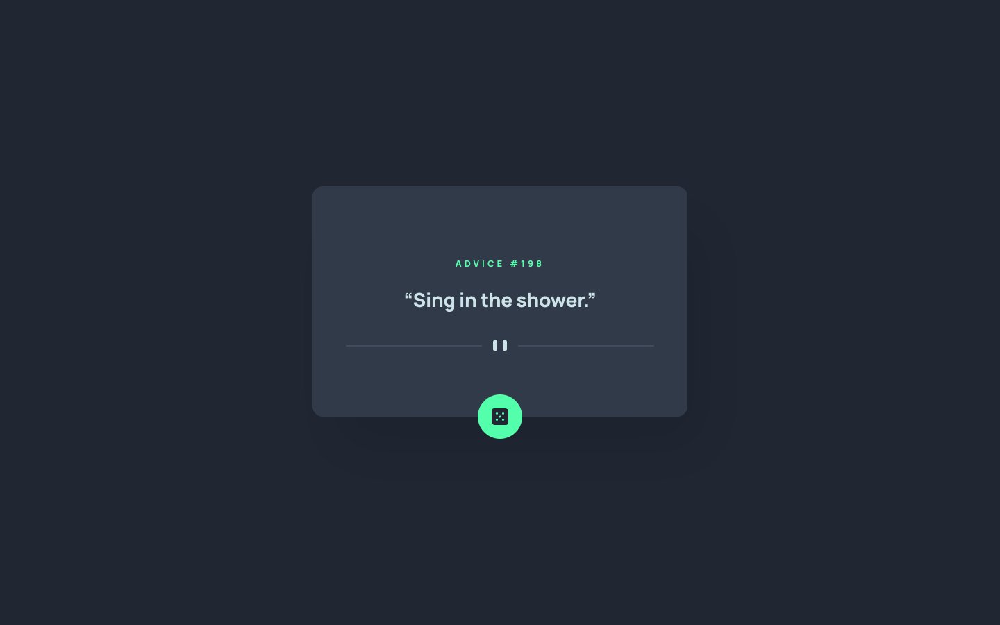
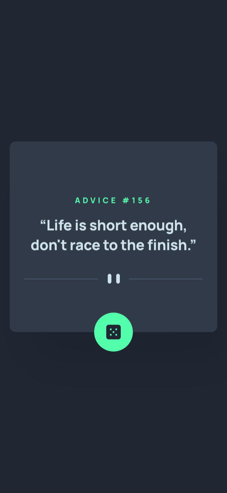

# Frontend Mentor - Advice generator app solution

This is a solution to the [Advice generator app challenge on Frontend Mentor](https://www.frontendmentor.io/challenges/advice-generator-app-QdUG-13db). Frontend Mentor challenges help you improve your coding skills by building realistic projects.

## Table of contents

- [Overview](#overview)
  - [The challenge](#the-challenge)
  - [Screenshot](#screenshot)
  - [Links](#links)
- [My process](#my-process)
  - [Built with](#built-with)
  - [What I learned](#what-i-learned)
  - [Continued development](#continued-development)
  - [Useful resources](#useful-resources)
  - [AI Collaboration](#ai-collaboration)
- [Author](#author)
- [Acknowledgments](#acknowledgments)

## Overview

### The challenge

Users should be able to:

- View the optimal layout for the app depending on their device's screen size
- See hover states for all interactive elements on the page
- Generate a new piece of advice by clicking the dice icon

### Screenshot

| Desktop (1440px) | Mobile (375px) |
| --- | --- |
|  |  |

### Links

- Solution URL: [https://www.frontendmentor.io/solutions/advice-generator-react-typescript-built-spec-first-qHhKuVXz8-](https://www.frontendmentor.io/solutions/advice-generator-react-typescript-built-spec-first-qHhKuVXz8-)
- Live Site URL: [https://fsdev-advice-generator-app.vercel.app](https://fsdev-advice-generator-app.vercel.app)

## My process

This project was built as a **Spec-Driven Development (SDD)** exercise using GitHub's Spec Kit. Rather than starting from code, the work moved through a constitution, a specification, a plan, and a task breakdown, each committed on its own branch before any source file existed. The design values were read from the Figma file through the Figma Desktop MCP rather than eyeballed from the exported assets.

### Built with

- Semantic HTML5 markup
- CSS custom properties — every design token declared once in `src/styles/variables.css`
- CSS Modules
- Flexbox
- Mobile-first workflow
- [React](https://react.dev/) - JS library
- [TypeScript](https://www.typescriptlang.org/) - Typed JavaScript
- [Vite](https://vite.dev/) - Build tool and dev server
- [Vitest](https://vitest.dev/) + [Testing Library](https://testing-library.com/) - Testing
- [Advice Slip API](https://api.adviceslip.com/) - Data source

### What I learned

**The API reports failure with HTTP 200.** Requesting a slip that does not exist returns a perfectly normal `200` response whose body is a different shape entirely:

```json
{ "message": { "type": "error", "text": "Advice slip not found." } }
```

A conventional `if (!response.ok) throw` never fires, and the UI renders `undefined`. Success has to be decided by inspecting the payload:

```ts
const { slip } = body as { slip?: unknown };
if (typeof slip !== 'object' || slip === null) return null;

const { id, advice } = slip as { id?: unknown; advice?: unknown };
if (typeof id !== 'number' || !Number.isFinite(id)) return null;
if (typeof advice !== 'string' || advice.trim() === '') return null;
```

**Caching headers can make the dice look broken.** The endpoint sends `Cache-Control: max-age=600, private, must-revalidate`, so a browser may serve the same slip for ten minutes — the user clicks and nothing appears to happen. `curl` hides this completely, because it implements no HTTP cache. Two mechanisms fix it:

```ts
requestCounter += 1;
const url = `${ENDPOINT}?t=${Date.now()}-${requestCounter}`;
const response = await fetch(url, { cache: 'no-store' });
```

The counter matters as much as the clock: several clicks can land inside the same millisecond, and `Date.now()` alone would produce an identical URL.

**The visible heading is not the page heading.** `ADVICE #117` names the current slip, not the page, and it changes on every click. Making it the `<h1>` would give the page a heading that constantly rewrites itself. It is a paragraph, and the page's single `<h1>` is visually hidden:

```tsx
<h1 className="visuallyHidden">Advice generator</h1>
```

**Content that changes in place is silent to screen readers.** There is no navigation and no focus move when new advice arrives, so the region is marked as a polite live region — polite rather than assertive, since the change is user-initiated:

```tsx
<div className={styles.advice} role="status" aria-live="polite">
```

**A fixed card height from the design doubles as a layout-shift fix.** Expressing the Figma card height as a `min-height` rather than a fixed height keeps the design accurate, accommodates unusually long advice, and stops the card resizing when the loading placeholder is replaced by real text.

### Continued development

- The divider swaps between two SVGs via `<picture>`; a single fluid SVG would remove the asset switch entirely.
- The failure message is one string for every failure path. Distinguishing "you are offline" from "the service is unavailable" would be friendlier, though it risks leaking technical detail.
- Request state is a hand-rolled discriminated union. On a larger project this is where a data-fetching library would earn its place.

### Useful resources

- [Advice Slip API documentation](https://api.adviceslip.com/) - The endpoint reference. Worth reading closely, since the failure behaviour is not what HTTP conventions suggest.
- [MDN: ARIA live regions](https://developer.mozilla.org/en-US/docs/Web/Accessibility/ARIA/ARIA_Live_Regions) - Explains the politeness levels and when content changes need announcing.
- [MDN: Request.cache](https://developer.mozilla.org/en-US/docs/Web/API/Request/cache) - What `no-store` actually guarantees, and what it does not.

### AI Collaboration

Built with **Claude Code** across the full Spec-Driven Development pipeline — constitution, specification, plan, tasks, and implementation.

What worked well:

- **Reading the design through the Figma MCP instead of guessing.** This caught a real conflict: the written style guide recorded a single 28px quote size, while the design uses 24px on mobile and 28px from tablet up. Taking the spec literally would have overflowed the mobile card.
- **Probing the live API before writing the fetch code.** The HTTP-200-on-failure behaviour and the caching headers were both found by calling the endpoint, not by assuming how it worked.
- **Writing tests before implementation** and confirming they failed first, so a passing suite meant something.

What needed care:

- AI verification claims deserve scepticism. An early check of cache-busting used `transferSize === 0` as evidence of cache hits — but that field is zeroed for *all* cross-origin responses without `Timing-Allow-Origin`, so it proved nothing. The real evidence was fourteen distinct URLs producing fourteen network requests.
- A failure-path check reported "leaks technical detail" because the test regex matched the word *fetch* inside the friendly message "Couldn't fetch advice right now". The test was wrong, not the code.

## Author

[](https://www.linkedin.com/in/gustavosanchezgalarza/)
[](https://github.com/gusanchefullstack)
[](https://hashnode.com/@gusanchedev)
[](https://x.com/gusanchedev)
[](https://bsky.app/profile/gusanchedev.bsky.social)
[](https://www.freecodecamp.org/gusanchedev)
[](https://www.frontendmentor.io/profile/gusanchefullstack)

## Acknowledgments

Thanks to [Frontend Mentor](https://www.frontendmentor.io) for the challenge and the design files, and to the [Advice Slip API](https://api.adviceslip.com/) for providing the advice free of charge.
